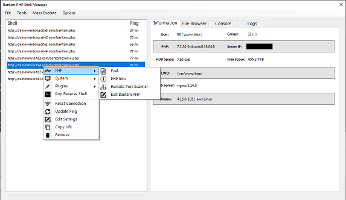

# bantam
An advanced PHP backdoor management tool, with a lightweight server footprint, multi-threaded communication, and an advanced payload generation and obfuscation tool. Features end to end encryption with request unique encryption keys designed to bypass WAF and IDS systems. It encorperates several 
payload randomization and obfuscation techniques to help prevent detection when encryption is not possible. Bantam is an ideal tool for linux PHP post exploitation privesc making it a breeze to upload enumeration scripts. Bantam also has a plugin system making it easy to add scripts and features to the ui. 
It is programmed in C# and runs on windows, and Linux using wine.

## Features
#### End to end request & response encryption - [encryption flow](documentation/encryption.png)
- AES-256 bit encryption on request & response data using openssl or mcrypt
- Response encryption keys are newly generated and embedded into the request payload for every request making every response unique, preventing detection from WAF and IDS systems
- Request encryption keys can be embedded using a pre-shared key/iv, or use a pre-shared key with a randomly generated IV that is passed through a known request variable making every request signature unique
#### Main form - [[img]](documentation/forms/main.png)

- Get Shell Information - [[img]](documentation/forms/main.png)
- Add Shell - [[img]](documentation/forms/add_shell.png)
- Eval tool - Opens a text editor that will eval the input text as a php payload
- Remote port scanner - Uses the bantam server to scan remote ports
- PHPInfo viewer - Opens the phpinfo page in an html window
- Self Editor - Edit the Bantam code stored on the server
- Linux - Helpful cmds and files. Dynamically included from [settings.xml](bantam/settings/settings.xml) (passwd, ps aux, ifconfig, ..etc) 
- Wndows - Helpful cmds and files. Dynamically included from [settings.xml](bantam/settings/settings.xml) (net user, hosts, ipconfig, ..etc)
- Windows Screenshot Grabber - Grabs a screenshot of the current screen
- Plugins - Dynamically include a php payload into the ui to be executed by setting up a plugin into the [settings.xml](bantam/settings/settings.xml)
- Reset connection - Removes the current shell and session info from ui, re-adds the shell and tests the connection
- Update ping - Updates the ping to the selected shell
- Edit settings - Opens the current shell settings into the ui to modify
- Copy url - Copyies the shell url to the clipboard
- Remove - Removes the shell from the ui
- Save Shells to xml
- Open Saved Shells from XML
#### Reverse Shell - [[img]](documentation/forms/reverse_shell.png)
- Spawns a reverse shell to the indicated IP/Port
- Methods supported - perl, netcat, netcat with pipe, telnet with pipe, php, bash, python, barrage(all)
- Bypass disabled_functions & open_basedir with [chankro](https://github.com/TarlogicSecurity/Chankro/)
#### Backdoor generator - [[img]](documentation/forms/backdoor_gen.png)
- Generates a php backdoor payload tailored for your settings
#### User Agent Switcher 
- Randomize or customize the useragent used in requests
#### Proxy Settings 
- Supports Socks and HTTP proxies
#### Mass Execute 
- Executes php payloads on all servers
- Port Scanner - Distributed port scan that splits the work between selected servers and port scans a remote host - [[img]](documentation/forms/port_scanner.png)
- Plugins - Dynamically include a custom payload from the [settings.xml](bantam/settings/settings.xml) into the gui to be mass executed
#### File Browser - [[img]](documentation/forms/filebrowser.png)
- Transverses file directories, and saves directory tree during current session
- Copy File
- Read File Content
- Delete file
- Rename File
- Upload File
  - Vectors - [LinEnum.sh](https://github.com/rebootuser/LinEnum/blob/master/LinEnum.sh) / [LinuxPrivChecker.sh](https://github.com/sleventyeleven/linuxprivchecker/blob/master/linuxprivchecker.py)
#### Console - [[img]](documentation/forms/console.png)
- Send shell commands to the server using the vector selected in options form, saves history during current session
#### Logs 
- Shows various logs and errors that could be generated by the application or server, adjustable verbosity in options form.
#### Options - [[img]](documentation/forms/options.png)
- Logging 
  - Log level - Determines which logs will be shown, higher level will show more logs
  - Enable Global logs
- Request settings
  - Max execution time - allows requests to run for max php execution time
  - Disable error logs - disables error logging for requests
  - Shell code vector - Shell code execution method (system/exec/shell_exec/passthru/popen/backticks)
  - Timeout (milliseconds) - Default request timeout
  - Max Post size (KiB) - Default max post size
  - Max Cookie size (B) - Locked to 4096 bytes
- Request Obfuscation
  - Inject Random Comments
    - Injects comments with random text into the php payloads
    - Comment frequency - Determines how many locations to inject comments into
    - Max Length - Determines the max length of the comments
  - Randomize PHP Var Names
    - Randomizes variable names in php payloads, Always on
    - Max length - Determines the max length of the random php varnames